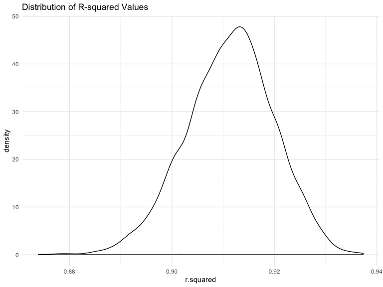

HW6
================
Holly Finertie - HF2379

    ## ── Attaching packages ──────────────────────────────────────── tidyverse 1.2.1 ──

    ## ✔ ggplot2 3.2.1     ✔ purrr   0.3.2
    ## ✔ tibble  2.1.3     ✔ dplyr   0.8.3
    ## ✔ tidyr   1.0.0     ✔ stringr 1.4.0
    ## ✔ readr   1.3.1     ✔ forcats 0.4.0

    ## ── Conflicts ─────────────────────────────────────────── tidyverse_conflicts() ──
    ## ✖ dplyr::filter() masks stats::filter()
    ## ✖ dplyr::lag()    masks stats::lag()

## Problem 1

### a) Load and tidy dataset:

``` r
birthweight = read_csv("./data/birthweight.csv") %>% 
  janitor::clean_names() %>% 
  mutate(
    babysex = factor(recode(babysex, 
              `1` = "Male", 
              `2` = "Female")), 
    frace = factor(recode(frace, 
              `1` = "White", 
              `2` = "Black",
              `3` = "Asian", 
              `4` = "Puerto Rican", 
              `8` = "Other", 
              `9` = "Unknown")), 
    malform = factor(recode(malform, 
              `0` = "Absent", 
              `1` = "Present")), 
    mrace = factor(recode(mrace, 
              `1` = "White", 
              `2` = "Black",
              `3` = "Asian", 
              `4` = "Puerto Rican", 
              `8` = "Other"))) 
```

    ## Parsed with column specification:
    ## cols(
    ##   .default = col_double()
    ## )

    ## See spec(...) for full column specifications.

``` r
anyNA(birthweight)
```

    ## [1] FALSE

### b) Build a model:

Many factors, including biological and social, affect birthweight. Per
[March of
Dimes](https://www.marchofdimes.org/complications/low-birthweight.aspxl),
social factors that affect low birthweight include substances use, SES,
violence, and race. Using the variables available in the
`birthweight.csv` dataset, I hypothesize that family income, mother’s
race, and number of cigarettes smoked per day during pregnancy will be
significantly associated with birthweight.

First, I will test the bivariate associations between birthweight and
each covariate of interest. Covariates significant at p-value \<0.25
will be considered in the multinomial multivariable analysis.

#### Bivariate Analysis

``` r
bwt_model = birthweight %>% 
  mutate(
    mrace = fct_infreq(mrace)) %>% 
  select(bwt, fincome, gaweeks, mrace, smoken)

model_fincome = lm(bwt ~ fincome, data = bwt_model) %>% 
  broom::tidy() %>% 
  select(term, estimate, p.value) 
```

  - **Birthweight and Family Income:** At the 5% level of significant,
    family income is significantly associated with birthweight. For
    every $100 increase in monthly income, birthweight increases by 3.05
    grams.

<!-- end list -->

``` r
model_mrace = lm(bwt ~  mrace, data = bwt_model) %>% 
  broom::tidy() %>% 
  select(term, estimate, p.value) 
```

  - **Birthweight and Mother’s Race:** At the 5% level of significant,
    mother’s race is significantly associated with birthweight. Compared
    to white mothers, all other races have baby’s with a lower
    birthweight. Black mothers have baby’s who weigh -316.56 grams less.
    Puerto Rican mothers have baby’s who weigh -211.32 grams less. Asian
    mothers have baby’s who weigh -126.43 grams less.

<!-- end list -->

``` r
model_smoken = lm(bwt ~  smoken, data = bwt_model) %>% 
  broom::tidy() %>% 
  select(term, estimate, p.value)
```

  - **Birthweight and Smoking:** At the 5% level of significant, smoking
    is significantly associated with birthweight. For every 1 additional
    cigarette smoked per day, birthweight decreases -5.23 grams.

#### Multivariable Analysis

Now that we confirmed all three variables are separately and
significantly associated with the outcome (birthweight), we can move
forward with backwards step-wise analysis. I will fit a model with all
three variables. If one is not signifcant at a 5% alpha level, I will
remove that variable and repeat until all variables are significant.

``` r
model_social = lm(bwt ~ fincome + mrace + smoken, data = bwt_model) 

tidy_social = model_social %>% 
  broom::tidy() %>% 
  select(term, estimate, p.value) %>% 
  knitr::kable(digits = 3)

tidy_social
```

| term              |  estimate | p.value |
| :---------------- | --------: | ------: |
| (Intercept)       |  3293.000 |   0.000 |
| fincome           |     0.750 |   0.015 |
| mraceBlack        | \-343.160 |   0.000 |
| mracePuerto Rican | \-232.878 |   0.000 |
| mraceAsian        | \-177.071 |   0.018 |
| smoken            |  \-11.099 |   0.000 |

All three variables are significant at a 5% alpha level.

``` r
added_social = bwt_model %>% 
  modelr::add_residuals(model_social) %>% 
  modelr::add_predictions(model_social)

plot_social = added_social %>% 
  ggplot(aes(x = pred, y = resid)) +
  geom_point()
```

### c) Test Against Other Models:

Based on the below plot, the model with the interaction terms (`bwt =
bhead + blength + babysex + bhead x blength + bhead x babysex + blength
x babysex + bhead x blength x babysex`) is the best fitting model with
the lowest mean squared errors.

``` r
model_main_effects = lm(bwt ~ blength + gaweeks, data = birthweight) 

model_interaction = lm(bwt ~ bhead + blength + babysex 
                       + bhead*blength + bhead*babysex + blength*babysex
                       + bhead*blength*babysex, data = birthweight) 

bwt_cv = 
  crossv_mc(birthweight, 100) 

bwt_cv %>% pull(train) %>% .[[1]] %>% as_tibble
```

    ## # A tibble: 3,473 x 20
    ##    babysex bhead blength   bwt delwt fincome frace gaweeks malform menarche
    ##    <fct>   <dbl>   <dbl> <dbl> <dbl>   <dbl> <fct>   <dbl> <fct>      <dbl>
    ##  1 Female     34      51  3629   177      35 White    39.9 Absent        13
    ##  2 Male       34      52  3062   157      55 White    40   Absent        14
    ##  3 Female     34      52  3374   156       5 White    41.6 Absent        13
    ##  4 Male       36      52  3515   146      85 White    40.3 Absent        11
    ##  5 Male       33      50  3459   169      75 Black    40.7 Absent        12
    ##  6 Female     35      51  3317   130      55 White    43.4 Absent        13
    ##  7 Female     35      48  3175   158      75 White    39.7 Absent        13
    ##  8 Male       36      53  3629   147      75 White    41.3 Absent        11
    ##  9 Female     33      49  2551   120      75 Black    38.1 Absent        11
    ## 10 Male       35      56  3232   147      55 White    42.1 Absent        13
    ## # … with 3,463 more rows, and 10 more variables: mheight <dbl>,
    ## #   momage <dbl>, mrace <fct>, parity <dbl>, pnumlbw <dbl>, pnumsga <dbl>,
    ## #   ppbmi <dbl>, ppwt <dbl>, smoken <dbl>, wtgain <dbl>

``` r
bwt_cv %>% pull(test) %>% .[[1]] %>% as_tibble
```

    ## # A tibble: 869 x 20
    ##    babysex bhead blength   bwt delwt fincome frace gaweeks malform menarche
    ##    <fct>   <dbl>   <dbl> <dbl> <dbl>   <dbl> <fct>   <dbl> <fct>      <dbl>
    ##  1 Male       34      48  3062   156      65 Black    25.9 Absent        14
    ##  2 Female     36      50  3345   148      85 White    39.9 Absent        12
    ##  3 Male       33      52  3374   129      55 White    40.7 Absent        12
    ##  4 Female     33      46  2523   126      96 Black    40.3 Absent        14
    ##  5 Female     33      49  2778   140       5 White    37.4 Absent        12
    ##  6 Male       35      51  3459   146      55 White    39.4 Absent        12
    ##  7 Male       35      51  3544   129      65 White    39.6 Absent        12
    ##  8 Female     36      51  2977   135      45 White    41.7 Absent        13
    ##  9 Female     35      51  3827   130      45 White    41.3 Absent        12
    ## 10 Male       35      53  3175   130      45 White    40.4 Absent        13
    ## # … with 859 more rows, and 10 more variables: mheight <dbl>,
    ## #   momage <dbl>, mrace <fct>, parity <dbl>, pnumlbw <dbl>, pnumsga <dbl>,
    ## #   ppbmi <dbl>, ppwt <dbl>, smoken <dbl>, wtgain <dbl>

``` r
bwt_cv =
  bwt_cv %>% 
  mutate(
    train = map(train, as_tibble),
    test = map(test, as_tibble))


bwt_cv = 
  bwt_cv %>% 
  mutate(
    model_social = map(train, ~ lm(bwt ~ fincome + mrace + smoken, data = bwt_model)),  
    model_main_effects = map(train, ~lm(bwt ~ blength + gaweeks, data = birthweight)), 
    model_interaction = map(train, ~lm(bwt ~ bhead + blength + babysex 
                       + bhead*blength + bhead*babysex + blength*babysex
                       + bhead*blength*babysex, data = birthweight))) %>% 
  mutate(rmse_social = map2_dbl(model_social, test, ~rmse(model = .x, data = .y)),
         rmse_main_effects = map2_dbl(model_main_effects, test, ~rmse(model = .x, data = .y)),
         rmse_interaction = map2_dbl(model_interaction, test, ~rmse(model = .x, data = .y)))


bwt_cv %>% 
  select(starts_with("rmse")) %>% 
  pivot_longer(
    everything(),
    names_to = "model", 
    values_to = "rmse",
    names_prefix = "rmse_") %>% 
  mutate(model = fct_inorder(model)) %>% 
  ggplot(aes(x = model, y = rmse)) + geom_violin() +
  labs(
    title = "Prediction Error Distributions Between Models"
  )
```

<!-- -->

## Problem 2

``` r
set.seed(1)

weather_df = 
  rnoaa::meteo_pull_monitors(
    c("USW00094728"),
    var = c("PRCP", "TMIN", "TMAX"), 
    date_min = "2017-01-01",
    date_max = "2017-12-31") %>%
  mutate(
    name = recode(id, USW00094728 = "CentralPark_NY"),
    tmin = tmin / 10,
    tmax = tmax / 10) %>%
  select(name, id, everything())
```

    ## Registered S3 method overwritten by 'crul':
    ##   method                 from
    ##   as.character.form_file httr

    ## Registered S3 method overwritten by 'hoardr':
    ##   method           from
    ##   print.cache_info httr

    ## file path:          /Users/hollyfinertie/Library/Caches/rnoaa/ghcnd/USW00094728.dly

    ## file last updated:  2019-11-18 16:36:46

    ## file min/max dates: 1869-01-01 / 2019-11-30

``` r
weather_bootstrap = weather_df %>% 
  modelr::bootstrap(n = 50) %>% 
  mutate(
    models = map(strap, ~ lm(tmax ~ tmin, data = .x)),
    results = map(models, broom::tidy), 
    glanced = map(models, broom::glance)) %>% 
  unnest(results, glanced) %>% 
  select(.id, r.squared, estimate, term) %>% 
  pivot_wider(
    names_from = term, 
    values_from = estimate
  ) %>% 
  select(-.id) %>% 
  rename(
    beta0 = `(Intercept)`, 
    beta1 = tmin) %>% 
  mutate(
    ln_betas = log(beta0*beta1))
```

    ## Warning: unnest() has a new interface. See ?unnest for details.
    ## Try `df %>% unnest(c(results, glanced))`, with `mutate()` if needed

### Plots

**1) R-squared**  
The plot below shows the distribution of R-squared. The 95% confidence
interval for R-squared is (0.9, 0.93).

``` r
weather_bootstrap %>% 
  ggplot(aes(x = r.squared)) + 
  geom_density() + 
  labs(
    title = "Distribution of R-squared Values"
  )
```

<!-- -->

**2) Log(beta0 x beta1)**  
The plot below shows the distribution of log(beta0\* beta1). The 95%
confidence interval for the log(beta0\*beta1) is (1.97, 2.06).

``` r
weather_bootstrap %>% 
  ggplot(aes(x = ln_betas)) + 
  geom_density() +
  labs(
    title = "Distribution of Log(beta0*beta1) Values"
  )
```

<!-- -->
