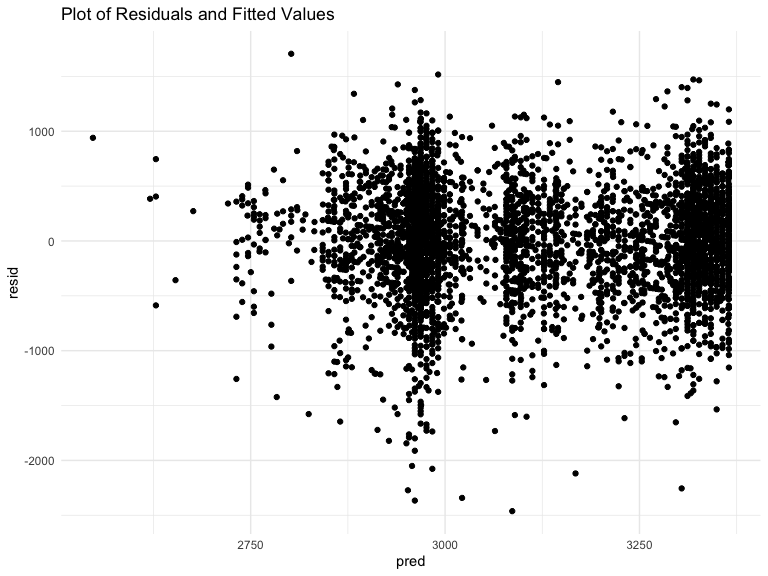

HW6
================
Holly Finertie - HF2379

    ## ── Attaching packages ──────────────────────────────────── tidyverse 1.2.1 ──

    ## ✔ ggplot2 3.2.1     ✔ purrr   0.3.2
    ## ✔ tibble  2.1.3     ✔ dplyr   0.8.3
    ## ✔ tidyr   1.0.0     ✔ stringr 1.4.0
    ## ✔ readr   1.3.1     ✔ forcats 0.4.0

    ## ── Conflicts ─────────────────────────────────────── tidyverse_conflicts() ──
    ## ✖ dplyr::filter() masks stats::filter()
    ## ✖ dplyr::lag()    masks stats::lag()

    ## Loading required package: viridisLite

## Problem 1

### a) Load and tidy dataset:

  - Confirmed no missing values
  - Converted race, malformation, and sex variables to factors
  - Converted variables with imperial units to metric

<!-- end list -->

``` r
birthweight = read_csv("./data/birthweight.csv") %>% 
  janitor::clean_names() %>% 
  mutate(
    babysex = factor(recode(babysex, 
              `1` = "Male", 
              `2` = "Female")), 
    frace = factor(recode(frace, 
              `1` = "White", 
              `2` = "Black",
              `3` = "Asian", 
              `4` = "Puerto Rican", 
              `8` = "Other", 
              `9` = "Unknown")), 
    malform = factor(recode(malform, 
              `0` = "Absent", 
              `1` = "Present")), 
    mrace = factor(recode(mrace, 
              `1` = "White", 
              `2` = "Black",
              `3` = "Asian", 
              `4` = "Puerto Rican", 
              `8` = "Other")), 
    delwt = 453.592*delwt, 
    ppwt = 453.592*ppwt, 
    wtgain = 453.592*wtgain, 
    mheight = 2.54*mheight)
```

    ## Parsed with column specification:
    ## cols(
    ##   .default = col_double()
    ## )

    ## See spec(...) for full column specifications.

``` r
anyNA(birthweight)
```

    ## [1] FALSE

### b) Model Building:

Many factors, including biological and social, affect birthweight. Per
[March of
Dimes](https://www.marchofdimes.org/complications/low-birthweight.aspxl),
social factors that affect low birthweight include substance use, SES,
violence, and race. Using the variables available in the
`birthweight.csv` dataset, I hypothesize that family income, mother’s
race, and number of cigarettes smoked per day during pregnancy will be
significantly associated with birthweight in grams.

First, I will test the bivariate associations between birthweight and
each covariate of interest. Covariates significant at p-value \<0.25
will be considered in the multinomial multivariable analysis.

#### Bivariate Analysis

``` r
bwt_model = birthweight %>% 
  mutate(
    mrace = fct_infreq(mrace)) %>% 
  select(bwt, fincome, gaweeks, mrace, smoken)

model_fincome = lm(bwt ~ fincome, data = bwt_model) %>% 
  broom::tidy() %>% 
  select(term, estimate, p.value) 

model_fincome %>% knitr::kable(digits = 3)
```

| term        | estimate | p.value |
| :---------- | -------: | ------: |
| (Intercept) | 2979.987 |       0 |
| fincome     |    3.048 |       0 |

  - **Birthweight and Family Income:** At the specified 25% level of
    significance, family income is significantly associated with
    birthweight. For every $100 increase in monthly income, birthweight
    increases by 3.05 grams. This variable will be considered in the
    final model.

<!-- end list -->

``` r
model_mrace = lm(bwt ~  mrace, data = bwt_model) %>% 
  broom::tidy() %>% 
  select(term, estimate, p.value) 

model_mrace %>% knitr::kable(digits = 3)
```

| term              |  estimate | p.value |
| :---------------- | --------: | ------: |
| (Intercept)       |  3266.663 |   0.000 |
| mraceBlack        | \-316.564 |   0.000 |
| mracePuerto Rican | \-211.321 |   0.000 |
| mraceAsian        | \-126.430 |   0.093 |

  - **Birthweight and Mother’s Race:** At the specified 25% level of
    significance, mother’s race is significantly associated with
    birthweight. Compared to white mothers, all other races have baby’s
    with a lower birthweight. Black mothers have baby’s who weigh
    -316.56 grams less. Puerto Rican mothers have baby’s who weigh
    -211.32 grams less. Asian mothers have baby’s who weigh -126.43
    grams less. These indicator variables will be considered in the
    final model.

<!-- end list -->

``` r
model_smoken = lm(bwt ~  smoken, data = bwt_model) %>% 
  broom::tidy() %>% 
  select(term, estimate, p.value)

model_smoken %>% knitr::kable(digits = 3)
```

| term        | estimate | p.value |
| :---------- | -------: | ------: |
| (Intercept) | 3136.079 |       0 |
| smoken      |  \-5.229 |       0 |

  - **Birthweight and Smoking:** At the specified 25% level of
    significance, smoking is significantly associated with birthweight.
    For every 1 additional cigarette smoked per day, birthweight
    decreases -5.23 grams. This variable will be considered in the final
    model.

#### Multivariable Analysis

Now that we confirmed all three variables are separately and
significantly associated with the outcome (birthweight), we can move
forward with backwards step-wise analysis. I will fit a model with all
three variables. If one is not signifcant at a 5% alpha level, I will
remove that variable and repeat until all variables are significant.

``` r
model_social = lm(bwt ~ fincome + mrace + smoken, data = bwt_model) 

tidy_social = model_social %>% 
  broom::tidy() %>% 
  select(term, estimate, p.value) %>% 
  knitr::kable(digits = 3)

tidy_social
```

| term              |  estimate | p.value |
| :---------------- | --------: | ------: |
| (Intercept)       |  3293.000 |   0.000 |
| fincome           |     0.750 |   0.015 |
| mraceBlack        | \-343.160 |   0.000 |
| mracePuerto Rican | \-232.878 |   0.000 |
| mraceAsian        | \-177.071 |   0.018 |
| smoken            |  \-11.099 |   0.000 |

``` r
glanced_social = model_social %>% 
  broom::glance()
```

All three variables are significant at a 5% alpha level. Additionally,
the model describes 12% of the total variance in birthweight (R-squared
= 0.12). Using the reported F-statistic of 113.03 and p-value of 0, we
can conclude that this model fits the data better than a model with only
an intercept.

#### Model Residuals Against Fitted Values

``` r
added_social = bwt_model %>% 
  modelr::add_residuals(model_social) %>% 
  modelr::add_predictions(model_social)

added_social %>% 
  ggplot(aes(x = pred, y = resid)) +
  geom_point() +
  labs(
    title = "Plot of Residuals and Fitted Values"
  )
```



### c) Test Against Other Models:

Based on the below plot, the model with the interaction terms (`bwt =
bhead + blength + babysex + bhead x blength + bhead x babysex + blength
x babysex + bhead x blength x babysex`) is the best fitting model with
the lowest mean squared errors.

``` r
model_main_effects = lm(bwt ~ blength + gaweeks, data = birthweight) 

model_interaction = lm(bwt ~ bhead + blength + babysex 
                       + bhead*blength + bhead*babysex + blength*babysex
                       + bhead*blength*babysex, data = birthweight) 

bwt_cv = 
  crossv_mc(birthweight, 100) 

bwt_cv = 
  bwt_cv %>% 
  mutate(
    model_social = map(train, ~ lm(bwt ~ fincome + mrace + smoken, data = bwt_model)),  
    model_main_effects = map(train, ~lm(bwt ~ blength + gaweeks, data = birthweight)), 
    model_interaction = map(train, ~lm(bwt ~ bhead + blength + babysex 
                       + bhead*blength + bhead*babysex + blength*babysex
                       + bhead*blength*babysex, data = birthweight))) %>% 
  mutate(rmse_social = map2_dbl(model_social, test, ~rmse(model = .x, data = .y)),
         rmse_main_effects = map2_dbl(model_main_effects, test, ~rmse(model = .x, data = .y)),
         rmse_interaction = map2_dbl(model_interaction, test, ~rmse(model = .x, data = .y)))


bwt_cv %>% 
  select(starts_with("rmse")) %>% 
  pivot_longer(
    everything(),
    names_to = "model", 
    values_to = "rmse",
    names_prefix = "rmse_") %>% 
  mutate(model = fct_inorder(model)) %>% 
  ggplot(aes(x = model, y = rmse)) + geom_violin() +
  labs(
    title = "Prediction Error Distributions Between Models"
  )
```


## Problem 2

``` r
set.seed(1)

weather_df = 
  rnoaa::meteo_pull_monitors(
    c("USW00094728"),
    var = c("PRCP", "TMIN", "TMAX"), 
    date_min = "2017-01-01",
    date_max = "2017-12-31") %>%
  mutate(
    name = recode(id, USW00094728 = "CentralPark_NY"),
    tmin = tmin / 10,
    tmax = tmax / 10) %>%
  select(name, id, everything())
```

    ## Registered S3 method overwritten by 'crul':
    ##   method                 from
    ##   as.character.form_file httr

    ## Registered S3 method overwritten by 'hoardr':
    ##   method           from
    ##   print.cache_info httr

    ## file path:          /Users/hollyfinertie/Library/Caches/rnoaa/ghcnd/USW00094728.dly

    ## file last updated:  2019-11-18 16:36:46

    ## file min/max dates: 1869-01-01 / 2019-11-30

``` r
weather_bootstrap = weather_df %>% 
  modelr::bootstrap(n = 5000) %>% 
  mutate(
    models = map(strap, ~ lm(tmax ~ tmin, data = .x)),
    results = map(models, broom::tidy), 
    glanced = map(models, broom::glance)) %>% 
  unnest(results, glanced) %>% 
  select(.id, r.squared, estimate, term) %>% 
  pivot_wider(
    names_from = term, 
    values_from = estimate
  ) %>% 
  select(-.id) %>% 
  rename(
    beta0 = `(Intercept)`, 
    beta1 = tmin) %>% 
  mutate(
    ln_betas = log(beta0*beta1))
```

### Plots

**1) R-squared**  
The plot below shows the distribution of R-squared values. The 95%
confidence interval for R-squared is (0.89, 0.93). The distribution is
left skewed, with more outliers with lower values. Across the the 5,000
bootstraps, the mean R-squared value is 0.911 which is slightly lower
than the median 0.912 due to the skewness.

``` r
weather_bootstrap %>% 
  ggplot(aes(x = r.squared)) + 
  geom_density() + 
  labs(
    title = "Distribution of R-squared Values"
  )
```


**2) Log(beta0 x beta1)**  
The plot below shows the distribution of log(beta0\* beta1) values. The
95% confidence interval for the log(beta0\*beta1) is (1.96, 2.06).
Visually, the distribution does not have any obvious skewness or
outliers and may follow a relatively normal distribution. Across the the
5,000 bootstraps, the mean value is 2.013 which is the same as the
median 2.013 indicating no skewness in the distribution. The log
transformation likely corrected any skewness in the data and created a
more normal distribution.

``` r
weather_bootstrap %>% 
  ggplot(aes(x = ln_betas)) + 
  geom_density() +
  labs(
    title = "Distribution of Log(beta0*beta1) Values"
  )
```


